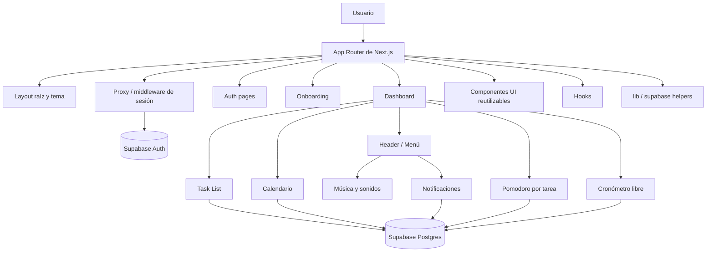

# Tempo

Tempo es una aplicación web de productividad construida con Next.js y Supabase para organizar tareas, trabajar por bloques de enfoque, visualizar fechas límite y acompañar la jornada con música, recordatorios y una experiencia visual cuidada.

La app está pensada como un espacio de trabajo completo: primero autentica al usuario, luego completa un onboarding mínimo de perfil y, a partir de ahí, habilita el tablero principal, calendario, temporizadores por tarea y edición de perfil.

---

## Resumen Rápido

| Área | Qué resuelve |
| --- | --- |
| Autenticación | Registro, inicio de sesión, recuperación de contraseña, verificación por enlace y manejo de sesión con Supabase. |
| Onboarding | Flujo obligatorio para completar datos básicos antes de entrar al dashboard. |
| Tareas | Alta, edición, orden, estados, prioridad, etiquetas, notas y progreso. |
| Enfoque | Pomodoro por tarea y cronómetro libre con control de tiempo real. |
| Calendario | Vista mensual/semanal de vencimientos y recordatorios. |
| Acompañamiento | Sonidos de ambiente, integración con Spotify y notificaciones. |
| Perfil | Edición del nombre del usuario desde el área privada. |

---

## Stack Y Configuración Base

| Capa | Tecnología |
| --- | --- |
| Framework | Next.js 16 con App Router |
| UI | React 19, Tailwind CSS, shadcn/ui, Radix UI |
| Estado y datos | SWR, Supabase JS, Supabase SSR |
| Animación | Framer Motion, GSAP |
| Calendario | FullCalendar |
| Estilo visual | Geist, variables CSS, tema claro/oscuro con `next-themes` |
| Tipado | TypeScript estricto |

### Dependencias destacadas

- `@supabase/ssr` y `@supabase/supabase-js` para autenticación, consultas y sesiones.
- `@fullcalendar/react`, `@fullcalendar/daygrid` y `@fullcalendar/interaction` para la vista de calendario.
- `lucide-react` para iconografía.
- `swr` para sincronización ligera de datos del tablero.
- `tailwindcss-animate`, `framer-motion` y `gsap` para detalles visuales y transiciones.
- `@radix-ui/*` y componentes locales en `components/ui` para formularios y overlays.

---

## Arquitectura General



### Flujo funcional

1. La ruta raíz redirige a `/auth/login`.
2. El middleware valida la sesión y mantiene la navegación privada sincronizada con Supabase.
3. Después del login, el usuario entra al dashboard solo si su perfil ya completó el onboarding.
4. El dashboard consume tareas, etiquetas, notas y recordatorios desde Supabase.
5. Las pantallas de Pomodoro, cronómetro libre y calendario trabajan sobre la misma base de tareas para mantener consistencia.

---

## Mapa De Rutas

| Ruta | Propósito |
| --- | --- |
| `/` | Redirección directa a login. |
| `/auth/login` | Acceso principal con recordar sesión local. |
| `/auth/sign-up` | Registro de usuario. |
| `/auth/sign-up-success` | Confirmación visual después del registro. |
| `/auth/forgot-password` | Solicitud de recuperación. |
| `/auth/update-password` | Cambio de contraseña con sesión activa. |
| `/auth/error` | Pantalla de error para flujos de auth. |
| `/auth/confirm` | Verificación de tokens OTP por correo. |
| `/onboarding` | Captura del nombre antes de entrar al dashboard. |
| `/dashboard` | Vista principal con saludo y lista de tareas. |
| `/dashboard/calendario` | Vista de calendario con recordatorios. |
| `/dashboard/perfil` | Edición del perfil. |
| `/dashboard/pomodoro/[taskId]` | Temporizador Pomodoro asociado a una tarea. |
| `/dashboard/cronometro/[taskId]` | Cronómetro libre asociado a una tarea. |

---

## Módulos Principales

### Autenticación

- Login con Supabase y opción de recordar credenciales en `localStorage`.
- Registro de usuario con redirección posterior a login.
- Recuperación y actualización de contraseña.
- Confirmación de enlace de correo mediante `verifyOtp`.
- Manejo de sesiones con helpers separados para servidor, navegador y proxy.

### Onboarding Y Perfil

- El onboarding pide completar el nombre antes de habilitar el dashboard.
- El perfil permite editar el nombre del usuario desde una pantalla dedicada.
- El layout privado redirige automáticamente si el perfil no está listo.

### Tareas

- Alta y edición de tareas con título, descripción, fechas, prioridad y posición.
- Cambio de estado entre pendiente y completada.
- Asignación de etiquetas con colores.
- Notas por tarea, persistidas en `task_notes`.
- Progreso y ciclos de enfoque guardados en la misma tabla de tareas.
- Sincronización ligera con SWR para refrescar listas y etiquetas.

### Pomodoro Por Tarea

- Temporizador por ciclos con descansos cortos y largos.
- Conteo de ciclos completados y progreso porcentual.
- Guardado del tiempo de enfoque real al finalizar o abandonar.
- Modal de configuración para ajustar duraciones y ciclos.
- Notas rápidas por sesión y sonido de finalización.

### Cronómetro Libre

- Temporizador personalizable para medir tiempo sin ciclos fijos.
- Sesión de trabajo y pausa breve.
- Ajuste del tiempo estimado desde un modal de configuración.
- Persistencia del tiempo total de enfoque.

### Calendario Y Recordatorios

- Calendario mensual/semanal con tareas activas y fechas límite.
- Panel lateral para crear recordatorios manuales.
- Recordatorios vinculados a tareas o independientes.
- Notificaciones del navegador cuando vence un recordatorio.
- Señalización visual de tareas con recordatorio ya asociado.

### Música Y Ambiente

- Barra lateral de música y ambiente controlada desde el header.
- Sonidos ambientales en bucle con control de volumen.
- Soporte para incrustar una playlist, álbum o canción pública de Spotify.
- La experiencia está pensada para trabajar sin salir del tablero.

---

## Capas Internas Del Proyecto

### `app/`

- Define rutas, layouts y páginas del sistema.
- El layout raíz aplica `ThemeProvider` y la fuente Geist.
- El layout de dashboard compone `MainHeader`, `MusicProvider`, `ToastProvider` y contenido principal.

### `components/`

Organiza la UI por dominios:

- `components/auth` y formularios de acceso.
- `components/tasks` para listado, edición y notas.
- `components/calendar` para la vista de agenda.
- `components/pomodoro-module` y `components/cronometro-module` para temporizadores.
- `components/music` para audio ambiental y Spotify.
- `components/notifications` para la campana y el panel de recordatorios.
- `components/header` para navegación y menú de usuario.
- `components/ui` para piezas reutilizables de diseño.

### `hooks/`

- `use-reminders.ts` consulta recordatorios activos, escucha cambios en tiempo real y dispara notificaciones.
- `use-notification-sound.ts` encapsula el audio de alerta.

### `lib/`

- `lib/supabase/server.ts` crea el cliente de servidor con cookies.
- `lib/supabase/client.ts` crea el cliente de navegador.
- `lib/middleware.ts` y `lib/supabase/proxy.ts` mantienen la sesión y el acceso privado.
- `lib/utils.ts` concentra utilidades como `cn` y validación de variables de entorno.

---

## Configuración Local

### Requisitos

- Tener Node.js instalado.
- Disponer de una instancia de Supabase con autenticación y tablas activas.

### Variables De Entorno

Crear un archivo `.env.local` con, al menos, estas variables:

```bash
NEXT_PUBLIC_SUPABASE_URL=tu_url_de_supabase
NEXT_PUBLIC_SUPABASE_PUBLISHABLE_KEY=tu_clave_publicable
```

Según los helpers del proyecto, también existe compatibilidad con la variante:

```bash
NEXT_PUBLIC_SUPABASE_PUBLISHABLE_OR_ANON_KEY=tu_clave_publicable_o_anon
```

### Scripts Disponibles

| Script | Descripción |
| --- | --- |
| `npm run dev` | Ejecuta el servidor de desarrollo. |
| `npm run build` | Genera la build de producción. |
| `npm run start` | Inicia la app compilada. |
| `npm run lint` | Ejecuta ESLint sobre el proyecto. |

### Instalación

```bash
git clone https://github.com/ItsLouis30/Tempo-App.git
cd organizador-tareas
npm install
npm run dev
```

---

## Estructura Del Proyecto

```text
app/
    auth/
    dashboard/
    onboarding/
components/
    calendar/
    cronometro-module/
    header/
    music/
    notifications/
    pomodoro-module/
    tasks/
    ui/
hooks/
lib/
public/sounds/
```

---

## Detalles Visuales

- Tema global con `next-themes` y variables CSS en `app/globals.css`.
- Tipografía base Geist con `next/font/google`.
- Estilos con paletas personalizadas para dashboard, música, pomodoro, cronómetro y calendario.
- Interfaz construida para mezclar paneles, overlays y superficies con contraste fuerte.
- Uso de `shadcn/ui` y Radix para formularios y componentes accesibles.

---

## Notas De Implementación

- La navegación privada depende de que el perfil esté completo.
- El calendario y los temporizadores leen tareas desde la misma base de datos para no duplicar estados.
- Los recordatorios usan tiempo local de Lima en varios cálculos y formatos.
- El proyecto está preparado para funcionar con sesión persistente y actualizaciones en tiempo real.

---

## Autor

Proyecto desarrollado por ItsLouis30.
