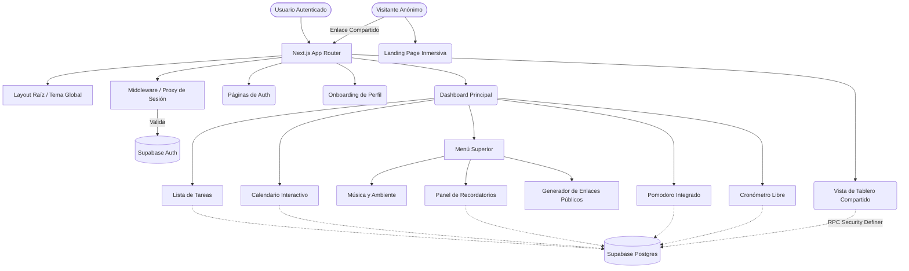

<div align="center">

# ⏳ Tempo

**Tu espacio personal para el enfoque y la productividad.**

[](https://nextjs.org/)
[](https://react.dev/)
[](https://tailwindcss.com/)
[](https://supabase.com/)
[](https://gsap.com/)

Tempo es una aplicación web de productividad construida para organizar tus tareas, trabajar por bloques de enfoque, visualizar tus fechas límite y acompañar tu jornada con música y un ambiente cuidado visualmente.

</div>

---

## ✨ Características Principales

| Característica | Descripción |
| :--- | :--- |
| 🔐 **Autenticación Segura** | Registro, inicio de sesión y recuperación de contraseña impulsados por Supabase. |
| 🤝 **Tableros Compartidos** | Comparte tus tareas mediante un enlace público de solo lectura. Los visitantes no necesitan cuenta para visualizar tu progreso. |
| 📝 **Gestión de Tareas** | Crea, edita, reordena y prioriza tus tareas. Añade etiquetas y notas detalladas. |
| 🍅 **Bloques de Enfoque** | Integración de Pomodoro nativo y cronómetro libre vinculados a cada tarea, con un elegante diseño "Glassmorphism". |
| 📅 **Calendario Interactivo** | Vista mensual y semanal completa para que no pierdas ningún vencimiento. |
| 🎧 **Acompañamiento Musical** | Sonidos de ambiente y reproductor integrado de Spotify para máxima concentración. |
| 🚀 **Landing Page Inmersiva** | Presentación "Sticky Scroll" impulsada por GSAP y navegación vertical dinámica. |

---

## 🚀 Inicio Rápido

Sigue estos pasos para levantar el proyecto localmente en cuestión de minutos.

### Requisitos Previos

- **Node.js** instalado (recomendado v20+).
- Un proyecto en **Supabase** con tablas de base de datos y autenticación habilitadas.

### 1. Clonar el repositorio

```bash
git clone https://github.com/ItsLouis30/Tempo-App.git
cd organizador-tareas
```

### 2. Instalar las dependencias

```bash
npm install
```

### 3. Configurar variables de entorno

Crea un archivo `.env.local` en la raíz del proyecto usando el `.env.example` como referencia. Deberás añadir tus credenciales de Supabase:

```env
NEXT_PUBLIC_SUPABASE_URL=tu_url_de_supabase_aqui
NEXT_PUBLIC_SUPABASE_PUBLISHABLE_KEY=tu_clave_publicable_anon_aqui
```

### 4. Levantar el servidor de desarrollo

```bash
npm run dev
```

> **Tip:** Visita `http://localhost:3000` en tu navegador para ver la aplicación funcionando y disfrutar de la nueva Landing Page inmersiva.

---

## 🛠️ Stack Tecnológico

El proyecto está construido sobre las herramientas más modernas del ecosistema web:

- **Core:** Next.js 16 (App Router), React 19.
- **Base de Datos & Auth:** Supabase (PostgreSQL).
- **Estilos & UI:** Tailwind CSS, shadcn/ui, Radix UI.
- **Tipado:** TypeScript estricto.
- **Animaciones Avanzadas:** GSAP (ScrollTrigger) y Framer Motion.
- **Gestión de Estado Ligera:** SWR.
- **Componentes Especiales:** FullCalendar (Agenda), `next-themes` (Modo claro/oscuro).

---

## 🏗️ Arquitectura y Flujo de Datos



> **Nota de Seguridad:** El middleware asegura que solo usuarios autenticados y con onboarding completado puedan acceder a `/dashboard`. Las rutas públicas como `/shared` están explícitamente permitidas sin comprometer la seguridad de las rutas protegidas.

---

## 💻 Innovaciones Técnicas en la UI (Landing Page)

La presentación pública de Tempo cuenta con un nivel técnico de UI/UX superior, diseñado para causar un gran impacto visual:

1. **GSAP ScrollTrigger:** Implementación de una sección anclada (`pin: true`) que intercala el scroll vertical nativo con transiciones de contenido, creando un efecto de presentación de "diapositivas" (Apple-style) sin bloquear el hilo principal.
2. **Glassmorphism Dinámico:** Uso extensivo de `backdrop-blur`, gradientes sutiles y bordes translúcidos combinados con `mix-blend-modes` para una integración perfecta de imágenes y fondos.
3. **Navegación Vertical Desacoplada:** 
   - Un indicador lateral personalizado que lee el progreso matemático de GSAP.
   - Traduce `scroll.progress` de 0 a 1 a puntos de navegación lógicos.
   - Permite navegación fluida (click to scroll) hacia posiciones inter-animación calculadas algorítmicamente.
4. **Fallback Responsivo:** Lógica limpia con `ScrollTrigger.matchMedia` para deshabilitar las animaciones pesadas en dispositivos móviles (pantallas < 768px), mostrando una versión apilada de alto rendimiento.

---

## 📂 Estructura del Proyecto

Una visión rápida de cómo está organizado el código fuente:

```text
📦 organizador-tareas
 ┣ 📂 app/              # Rutas principales (Auth, Dashboard, Landing) y layouts globales
 ┣ 📂 components/       # Componentes organizados por dominio:
 ┃ ┣ 📂 auth/           # Formularios de login/registro
 ┃ ┣ 📂 tasks/          # Lógica visual de tareas y listados
 ┃ ┣ 📂 pomodoro/       # Módulo de temporizador por ciclos
 ┃ ┣ 📂 calendar/       # Integración con FullCalendar
 ┃ ┣ 📂 ui/             # Componentes base reutilizables (shadcn/ui)
 ┃ ┗ ...
 ┣ 📂 hooks/            # Hooks personalizados (ej. use-reminders, notificaciones sonoras)
 ┣ 📂 lib/              # Configuración de Supabase, middleware y utilidades generales
 ┗ 📂 public/           # Assets estáticos (screenshots, sonidos, fuentes, íconos)
```

---

<div align="center">

Desarrollado por **ItsLouis30**.

</div>
