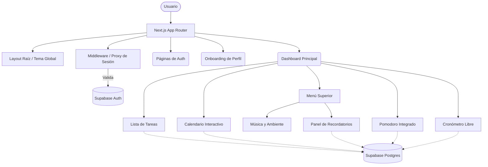

<div align="center">

# ⏳ Tempo

**Tu espacio personal para el enfoque y la productividad.**

[](https://nextjs.org/)
[](https://react.dev/)
[](https://tailwindcss.com/)
[](https://supabase.com/)
[](https://www.typescriptlang.org/)

Tempo es una aplicación web de productividad construida para organizar tus tareas, trabajar por bloques de enfoque, visualizar tus fechas límite y acompañar tu jornada con música y un ambiente cuidado visualmente.

</div>

---

## ✨ Características Principales

| Característica | Descripción |
| :--- | :--- |
| 🔐 **Autenticación Segura** | Registro, inicio de sesión y recuperación de contraseña impulsados por Supabase. |
| 📝 **Gestión de Tareas** | Crea, edita, reordena y prioriza tus tareas. Añade etiquetas y notas detalladas. |
| 🍅 **Bloques de Enfoque** | Integración de Pomodoro nativo y cronómetro libre vinculados a cada tarea. |
| 📅 **Calendario Interactivo** | Vista mensual y semanal completa para que no pierdas ningún vencimiento. |
| 🎧 **Acompañamiento Musical** | Sonidos de ambiente y reproductor integrado de Spotify para máxima concentración. |
| 🔔 **Recordatorios** | Sistema de notificaciones en tiempo real para no olvidar lo importante. |
| 🎨 **Diseño Impecable** | UI minimalista, animaciones suaves con Framer Motion y soporte de Modo Oscuro. |

---

## 🚀 Inicio Rápido

Sigue estos pasos para levantar el proyecto localmente en cuestión de minutos.

### Requisitos Previos

- **Node.js** instalado (recomendado v20+).
- Un proyecto en **Supabase** con tablas de base de datos y autenticación habilitadas.

### 1. Clonar el repositorio

```bash
git clone https://github.com/ItsLouis30/Tempo-App.git
cd organizador-tareas
```

### 2. Instalar las dependencias

```bash
npm install
```

### 3. Configurar variables de entorno

Crea un archivo `.env.local` en la raíz del proyecto usando el `.env.example` como referencia. Deberás añadir tus credenciales de Supabase:

```env
NEXT_PUBLIC_SUPABASE_URL=tu_url_de_supabase_aqui
NEXT_PUBLIC_SUPABASE_PUBLISHABLE_KEY=tu_clave_publicable_anon_aqui
```

### 4. Levantar el servidor de desarrollo

```bash
npm run dev
```

> **Tip:** Visita `http://localhost:3000` en tu navegador para ver la aplicación funcionando.

---

## 🛠️ Stack Tecnológico

El proyecto está construido sobre las herramientas más modernas del ecosistema web:

- **Core:** Next.js 16 (App Router), React 19.
- **Base de Datos & Auth:** Supabase (PostgreSQL).
- **Estilos & UI:** Tailwind CSS, shadcn/ui, Radix UI.
- **Tipado:** TypeScript estricto.
- **Animaciones:** Framer Motion, GSAP.
- **Gestión de Estado Ligera:** SWR.
- **Componentes Especiales:** FullCalendar (Agenda), `next-themes` (Modo claro/oscuro).

---

## 🏗️ Arquitectura y Flujo de Datos



> **Nota de Seguridad:** El middleware asegura que solo usuarios autenticados y con onboarding completado puedan acceder a `/dashboard`.

---

## 📂 Estructura del Proyecto

Una visión rápida de cómo está organizado el código fuente:

```text
📦 organizador-tareas
 ┣ 📂 app/              # Rutas principales (Auth, Dashboard, Onboarding) y layouts globales
 ┣ 📂 components/       # Componentes organizados por dominio:
 ┃ ┣ 📂 auth/           # Formularios de login/registro
 ┃ ┣ 📂 tasks/          # Lógica visual de tareas y listados
 ┃ ┣ 📂 pomodoro/       # Módulo de temporizador por ciclos
 ┃ ┣ 📂 calendar/       # Integración con FullCalendar
 ┃ ┣ 📂 ui/             # Componentes base reutilizables (shadcn/ui)
 ┃ ┗ ...
 ┣ 📂 hooks/            # Hooks personalizados (ej. use-reminders, notificaciones sonoras)
 ┣ 📂 lib/              # Configuración de Supabase, middleware y utilidades generales
 ┗ 📂 public/           # Assets estáticos (sonidos ambientales, fuentes, íconos)
```

---

## 👨‍💻 Scripts Disponibles

En el directorio del proyecto, puedes ejecutar:

| Comando | Descripción |
| :--- | :--- |
| `npm run dev` | Inicia el servidor de desarrollo local con recarga en caliente. |
| `npm run build` | Compila la aplicación para producción de forma optimizada. |
| `npm run start` | Inicia la versión de producción previamente compilada. |
| `npm run lint` | Analiza el código con ESLint para encontrar y arreglar problemas. |

---

## 📝 Notas de Implementación

- **Consistencia de Datos:** El calendario, el Pomodoro y la lista principal consumen las mismas tareas de la base de datos, evitando desincronización de estados.
- **Husos Horarios:** Los recordatorios procesan el tiempo local (Lima por defecto) para la emisión correcta de notificaciones web.
- **Reactividad:** El uso de SWR permite mantener la lista de tareas y etiquetas actualizadas en tiempo real tras cualquier mutación, de forma optimizada.

---

<div align="center">

Desarrollado con ❤️ por **ItsLouis30**.

</div>
